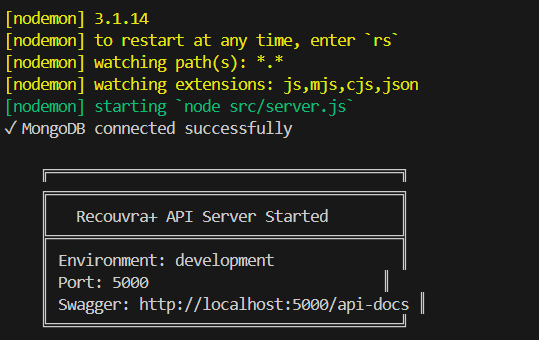

## Project Overview

Recouvra+ est une API REST complète pour gérer les clients, les factures impayées et les actions de recouvrement d'une entreprise. Le projet est structuré en modules fonctionnels pour faciliter le travail collaboratif en équipe.

## Team Structure & Responsibilities

| Personne | Module | Responsabilities |
|----------|--------|------------------|
| **Personne 1** | **Authentification & Utilisateurs** | JWT, Users CRUD, Rôles, Sécurité |
| Personne 2 | Clients & Factures | Gestion des clients, Factures, Paiements |
| Personne 3 | Actions de Recouvrement | Suivi, Statistiques, Reporting |
## Quick Start

### Prerequisites
- Node.js 22+
- MongoDB
- npm ou yarn

### Installation

1. **Clone Repository**
   ```bash
   git clone https://github.com/rayen43500/Gestion-du-recouvrement.git
   cd Gestion-du-recouvrement
   ```

2. **Install Dependencies**
   ```bash
   npm install
   ```

3. **Setup Environment**
   ```bash
   cp .env.example .env
   # Edit .env with your configuration
   ```

4. **Start Development Server**
   ```bash
   npm run dev
   ```

5. **Access API**
   - Base URL: `http://localhost:5000`
   - Swagger Docs: `http://localhost:5000/api-docs`

```

## Module Documentation

### Personne 1: Authentication & Users
**Complete Module Documentation**: [AUTH_README.md](./AUTH_README.md)

#### Key Features
- ✅ JWT Authentication
- ✅ User Registration & Login
- ✅ Role-Based Access Control (RBAC)
- ✅ Password Hashing with bcrypt
- ✅ 3 User Roles: Agent, Manager, Admin

#### API Endpoints
```
POST   /auth/register          - Register new user
POST   /auth/login             - Login user
GET    /auth/me                - Get current user
GET    /users                  - List all users (admin/manager)
GET    /users/:id              - Get user details
PUT    /users/:id              - Update user
DELETE /users/:id              - Delete user (admin)
```

---

### Personne 2: Clients & Invoices
**Coming Soon** - Expected: March 15, 2026

#### Expected Features
- Client management (CRUD)
- Invoice management
- Invoice status tracking
- Manual payment recording

#### Expected Endpoints
```
GET/POST   /clients            - List/Create clients
GET/PUT    /clients/:id        - Get/Update client
GET/POST   /invoices           - List/Create invoices
GET/PUT    /invoices/:id       - Get/Update invoice
POST       /payments           - Record payment
```

---

### Personne 3: Recovery Actions
**Coming Soon** - Expected: March 20, 2026

#### Expected Features
- Recovery action tracking
- Communication history
- Statistics & reporting
- Action status management

#### Expected Endpoints
```
GET/POST   /actions            - List/Create recovery actions
GET/PUT    /actions/:id        - Get/Update action
GET        /statistics         - Get recovery statistics
```

---

### Personne 4: Integration & Testing
**Coming Soon** - Expected: March 25, 2026

#### Expected Tasks
- End-to-end testing
- API integration tests
- CI/CD pipeline setup
- Complete API documentation

## 🔐 Security Features

- ✅ JWT Token-based Authentication
- ✅ Password Hashing (bcrypt)
- ✅ Role-Based Access Control
- ✅ Input Validation (Joi)
- ✅ Account Status Checking
- ✅ Protected Routes

##  Testing

```bash
# Run all tests
npm test

# Run tests in watch mode
npm run test:watch

# Run with coverage
npm test -- --coverage
```

### Test Organization
- `tests/auth.test.js` - Authentication tests
- `tests/users.test.js` - User CRUD tests
- `tests/user.model.test.js` - User model tests

##  Technologies

| Layer | Technology |
|-------|-----------|
| **Runtime** | Node.js 22 |
| **Framework** | Express.js 5.2 |
| **Database** | MongoDB + Mongoose |
| **Authentication** | JWT (jsonwebtoken) |
| **Password Security** | bcryptjs |
| **Validation** | Joi |
| **Documentation** | Swagger/OpenAPI |
| **Testing** | Jest + Supertest |
| **Dev Tools** | Nodemon |

##  Configuration

### Environment Variables

```env
# Server
PORT=5000
NODE_ENV=development

# Database
MONGODB_URI=mongodb://localhost:27017/recouvra

# JWT
JWT_SECRET=your_secret_key_here
JWT_EXPIRE=7d

# Roles
VALID_ROLES=agent,manager,admin
```

##  API Documentation

Complete API documentation is available via Swagger UI:

```
http://localhost:5000/api-docs
```

### Health Check

```bash
curl http://localhost:5000/health
```

Response:
```json
{
  "success": true,
  "message": "API is running",
  "timestamp": "2024-03-09T10:30:00Z"
}
```

##  Development Workflow

### 1. Create Feature Branch
```bash
git checkout -b feature/your-feature-name
```

### 2. Make Changes
```bash
# Make code changes
git add .
git commit -m "feat: add new feature"
```

### 3. Run Tests
```bash
npm test
```

### 4. Push & Create PR
```bash
git push origin feature/your-feature-name
# Create Pull Request on GitHub
```

### 5. Merge
After review and approval, merge to main branch

##  User Roles & Permissions

### Agent
- View own profile
- Update own profile
- Basic access to invoice system

### Manager
- View all users
- View all clients/invoices
- Manage recovery actions
- Generate reports

### Admin
- Full system access
- Manage all users
- Change user roles
- System configuration

##  Common Errors & Solutions

| Error | Solution |
|-------|----------|
| MongoDB connection failed | Ensure MongoDB is running |
| JWT Token expired | User needs to login again |
| Forbidden (403) | Check user role/permissions |
| Validation error (400) | Check request body format |
| Email already exists (409) | Use different email |


##  Useful Links

- [Authentication Module Docs](./AUTH_README.md)
- [Express.js Docs](https://expressjs.com)
- [Mongoose Docs](https://mongoosejs.com)
- [JWT.io](https://jwt.io)
- [Swagger Editor](https://editor.swagger.io)
- [MongoDB Docs](https://docs.mongodb.com)


**Last Updated**: March 9, 2026  
**API Version**: 1.0.0  
**Node.js Version**: 22+
